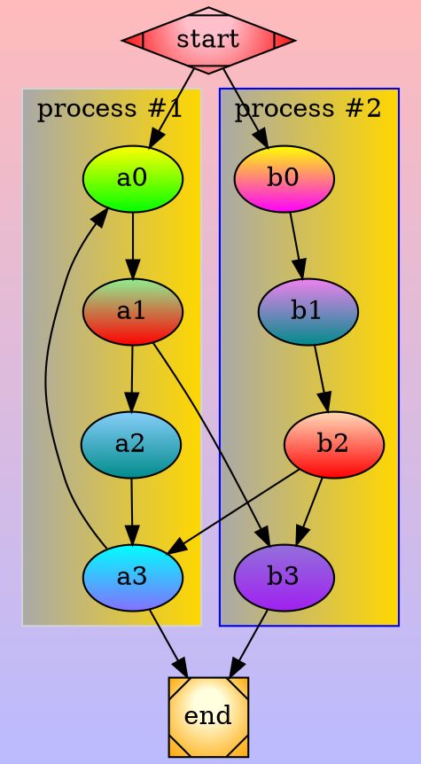

import Bandcamp from "~/components/Bandcamp.astro";
import Code from "~/components/Code.astro";

# Every Thing Originates From a Loop ...

<Bandcamp
  album="601638532"
  track="4140453006"
  artwork="small"
  size="large"
  minimal={true}
/>

...everything Else is a Remix.

# Concept

Tool to output stuff into public.

## Why? (Motivation)

- Artistic expression
- Blow off steam

### why Public?

- Private already exists
- Observer effect
  - Experimentation

## Structure

- Display Content
  - Embeddings (audio, code, diagrams, pictures, video, ...)
  - Navigation
- Feedback (comments)

# Manifestation

Brief and Simple.

## Base

Web Application.

### Tools

#### Engine

[Astro](https://astro.build/):

- Satisfies most of my demands
- Provides flexibility to satisfy the rest
- Well aligned with contemporaneity principles

<details>
<summary>Some alternatives</summary>

- Other static website generators:
  - [Docusaurus](https://docusaurus.io/) (I don't like React)
  - [Gatsby](https://www.gatsbyjs.com/)
  - [Hugo](https://gohugo.io/)
- Frameworks:
  - [Rails](https://rubyonrails.org/)
  - [Django](https://www.djangoproject.com/)
  - [Solid Start](https://start.solidjs.com/)
- [PHP](https://www.php.net/) which, they say, [doesn suck that much lately](https://www.youtube.com/results?search_query=php+doesn%27t+suck); but I wouldn't care

</details>

#### Platform

- [Github](https://github.com/)
  - [Repositories](https://docs.github.com/en/repositories) for code
  - [Pages](https://docs.github.com/en/pages) for static hosting
  - [Discussions](https://docs.github.com/en/discussions) for feedback
  - [GraphQL](https://docs.github.com/en/graphql) for integration
- [Google Cloud Platform](https://cloud.google.com/)
  - [Cloud Functions](https://cloud.google.com/functions/) for authentication


<details>
<summary>Some alternatives</summary>

- For code:
  - [Codeberg](https://codeberg.org/)🤗
- For static hosting:
  - [Codeberg's Pages](https://docs.codeberg.org/codeberg-pages/)
  - Netlify
- For Feedback:
  - [ActivityPub](https://activitypub.rocks/)
    - [Mastodon](https://github.com/mastodon/mastodon)?🤨
  - [SMTP](https://en.wikipedia.org/wiki/Simple_Mail_Transfer_Protocol) 🥲
- Authentication
  - AWS Lambdas🤑

</details>


## Features

### Display Content

MDX format provides most of the features out of the box:
- Embedding pictures
- Embedding HTML parts

Some specific cases to be solved on occurrence.


#### Diagrams

Structured Information Representation is often the essential for delivery of an idea.

I often think while moving stuff around in a [draw.io](https://app.diagrams.net/).

Diagrams within website content should be text to graphics.


##### Options

###### Mermaid

[mermaid-js](https://mermaid.js.org/) has ready to use
[Astro integration](https://code.juliancataldo.com/component/astro-diagram)
Thanks to [Julian Cataldo](https://github.com/JulianCataldo).

Downsides:

- syntax and diagrams look chaotic
- there is very small subset of UML supported
- almost no control over layouts
- requires puppeteer (i.e. browser) to render text into SVG 🤦‍♂️

Alternative - Remark plugin:

- won't eliminate any downsides (mermaid has this complexity flow in its core)
- there is more than one options to research


###### Graphviz

Robust Versatile C library for Complex Graph Visualizations.

Issues with Color Scheme Preference: in dark mode text is hardly readable.

<details>
<summary>Example</summary>

In light mode this looks okay.
</details>

<details>
<summary>Integration</summary>
<Code
  lang="typescript"
  file="src/integrations/graphviz.ts"
/>
Thanks to [WASM port of Graphviz](https://github.com/hpcc-systems/hpcc-js-wasm).
</details>


###### svgbob

Sweet stuff for dessert.

[svgbob](https://github.com/ivanceras/svgbob) is an ASCII graphics to SVG converter written
in Rust.

<details>
<summary>It is just amazing.</summary>
```bob
.-----------------.
| i love svgbob!  |
'------+ .--------'
       |/      .--------------.
      .-.   .-(  learn  stuff  )
      '+'  /   '--------------'
      /|\-+           ^
      / \  \          |
     Alex   \    .------------.
             '--( make   stuff )
                 '------------'
````

Is encoded with:

```bob
.-----------------.
| i love svgbob!  |
'------+ .--------'
       |/      .--------------.
      .-.   .-(  learn  stuff  )
      '+'  /   '--------------'
      /|\-+           ^
      / \  \          |
     Alex   \    .------------.
             '--( make   stuff )
                 '------------'
```

More examples [here](https://ivanceras.github.io/svgbob-editor/).

</details>

<details>
<summary>The integration of svgbob is almost same easy as graphviz</summary>
<Code
  lang="typescript"
  file="src/integrations/svgbob.ts"
/>
Thanks to kind people who created [svgbob WASM port](https://github.com/agoose77/svgbob-wasm) and [wrapper for it](https://github.com/fabiospampinato/bob-wasm/tree/master).

I have just removed style to fit SVG style into the website's style.

</details>


##### Summary

|              | mermaid  | graphviz | svgbob   |
| ------------ | -------- | -------- | -------- |
| usage        | simple   | complex  | tedious  |
| integration  | complex  | simple   | simple   |
| flexibility  | fair     | extreme  | hackable |
| performance  | errgh?.. | fast     | fast     |
| designation  | frontend | backend  | backend  |
| productivity | high     | depends  | low      |

All three options can coexist providing their benefits when required.

However, I have not been completely satisfied by neither of them and feel an urge to
experiment with text to diagram myself. Hopefully I will find time.


#### Music (Bandcamp)

Cross origin policy should prevent some tracking.

<details>
<summary>The integration</summary>

<Code lang="typescript" file="src/components/Bandcamp.astro"/>

Killswitch is needed to keep console clear from CORS errors.

</details>


### Navigation (Preview)


#### Page Types

1. Article (is a Content Item)
2. List of Content Item Previews


#### Display Rules

* Each article has an Id to match with any bound resources (e.g. Discussion)
* If List Page contains single Item Preview, redirect to that Item instead of showing it


#### Preprocessing

<details>
<summary>Vite plugin to embed Ids and generate Previews.</summary>
<Code lang="typescript" file="src/integrations/vite.ts"/>
`src/content/config.ts` appears in Vite's `load` hook each time content changes.
</details>


### Feedback

Discussions bound to content.


#### Why?

- Rational:

  Feedback is important part of any system.

  If a system is not capable of receiving a feedback it is singular, i.e. does not have
  volume. Lack of volume makes it a "ghost": removes its ability to interact with
  environment.

- Irrational:

  I want to do it myself to have better control over the ways data handled.


#### How?

- Use Github discussions to persist data.

- Integrate with project:

  User and Repository from origin URL are part of configuration

<details>
<summary>Some ready to use alternatives</summary>

- [giscus](https://github.com/giscus/giscus/)
- [utterances](https://github.com/utterance/utterances)
- [Gitalk](https://github.com/gitalk/gitalk)

</details>

```bob
      .-.
      '+'                  +-----------+          +--------------+                 +-------------+
     --+--                 |           |          |              |                 |             |
       |                   | Website   |          |   Github     |                 |   Server    |
      / \                  |           |          |              |                 |             |
     /   \                 +-----+-----+          +-------+------+                 +------+------+
     User                        |                        |                               |
       |
                                 |                        |                               |
       |
      +++  access   comments     |                        |                               |
      | |---------------------->+++
      | |    go  to  Github     | |                                                       |
      | |<- - - - - - - - - - - +++                       |
      | |                        |                                                        |
      | |----------------------------------------------->+-+
      | |                        |                       | |                              |
 + - -| | - - - - - - - - - - - - - - - - - - - - - - - -| |- -+
 | if  Github  session  expired  |                       | |   |                          |
      | |                                                | |
 |    | |     do   you   authorize   this   Website?    +++|   |                          |
      | |<----------------------------------------------| ||
 |    | |                 yeah ,  sure                  | ||   |                          |
      | |- - - - - - - - - - - - - - - - - - - - - - - >+++|
 |    | |                        |                       | |   |                          |
 + - -| |- - - - - - - - - - - - - - - - - - - - - - - - | | - +
      | |                        |      Auth   Code      | |                              |
      | |                       +++<- - - - - - - - - - -+++
      | |                       | | issue   me   a   token,   I   have   Auth   Code      |
      | |                       | |----------------------------------------------------->+++
      | |                       | |                       |    Auth   Code   +   Secret  | |
      | |                       | |                      +++<----------------------------| |
      | |                       | |                      | |   Auth   Token              | |
      | |                       | |                      +++- - - - - - - - - - - - - - >| |
      | |                       | |        Auth   Token   |                              | |
      | |                       | |<- - - - - - - - - - - - - - - - - - - - - - - - - - -+++
      | |                       | |                       |                               |
      | |                       | |
      | |                       | |                       |
      | |                       | |                                                +------------+
      | |                       | |        Auth   Token   |                        |            |
      | |                       +++----------------------------------------------->|  GraphQL   |
      | |                        |                        |                        |            |
      | | show   me   data       |                                                 +------+-----+
      | |---------------------->+++  get me data          |                               |
      | |                       | |----------------------------------------------------->+++
      | |                       | |                       |   request   +  Auth  Token   | |
      | |                       | |                      +++<----------------------------| |
      | |                       | |                      | |  response  with  data       | |
      | |                       | |                      +++- - - - - - - - - - - - - - >| |
      | |                       | |     data                                             | |
      | |  data   view          | |<- - - - - - - - - - - - - - - - - - - - - - - - - - -+++
      | |< - - - - - - - - - - -+++                                                       |
      | |                        |
      +++                                                                                 |
       |                         |
```


#### Authentication

Microservice for [OAuth Code Grant](https://datatracker.ietf.org/doc/html/rfc6749#section-4.1) flow

<details>
<summary>Alternative</summary>

[Github Apps](https://docs.github.com/en/apps):

- requires a bit more complicated backend
- allows fine-grained permissions settings => more secure
- non-standard (comparing to standardized OAuth2 framework)

</details>

<details>
<summary>Client-side Authentication</summary>

Discussions are `client:only`.

Github-harness is provided as &lt;Github/&gt; component. It follows semantics of
[Solid's &lt;Show/&gt;](https://www.solidjs.com/docs/latest/api#show):

```jsx
<Github
  fallback={(LoginButton) => (
    /* render login UI here */
  )}
  {...clientConfiguration}
>
  {(client, LogoutButton) => (
    /* use client to fetch data for UI */
  )}
</Github>
```

- Access Token is only in memory of that component.
- If page is refreshed, token is gone.

<Code lang="tsx" file="src/components/Github.tsx" />
</details>

<details>
<summary>Server-side Authentication</summary>

1. Cloud function is [cost efficient for such tasks](https://cloud.google.com/functions/pricing):

   Considering amount of expected visitors equal to zero, it should be free.

2. GCP Secret Manager is used to store Client Secret

   - Delegation is a profitable strategy when applied wisely☝

   - Storing small amount of secrets [is also almost free in GCP](https://cloud.google.com/secret-manager/pricing)

Prerequisites:

- [Create OAuth application on Github](https://github.com/settings/developers)

  - Set `github_client_secret` in GCP Secret Manager

    Secret Manager should contain `github_client_secret` with `latest` version value
    corresponding to the actual Client Secret provided by Github

  - Set `GITHUB_OAUTH_CLIENT_ID` environment variable

- Service Account (by default - App Engine's default SA) which executes cloud
  function MUST have role "Secret Manager Secret Accessor"

  > **NOTE:** It should be possible to setup fine-grained rules for each role, but for me
  > it did not work for a specific secret name

- Set `BASE_URL` environment variable

  > **ATTENTION:** One may fail a part, but ought to chamfer it.
  > Same with security: don't neglect CORS, set exact URLs in policy headers.

<Code lang="go" file="auth/github-oauth2-handler.go" />

Why go? - It's the fastest available.

Deployment script:

<Code
  lang="sh"
  file="scripts/deploy-auth-cloud-function.sh"
/>
</details>


#### Github GraphQL Client

Inception: [Github's GraphQL Explorer](https://docs.github.com/en/graphql/overview/explorer).


##### Tools

- [@graphql-codegen/cli](https://the-guild.dev/graphql/codegen) to bind schema to code

- [URQL](https://formidable.com/open-source/urql/) to execute requests

<details>
<summary>Alternatives</summary>

- [@octokit/graphql](https://github.com/octokit/graphql.js/)

  does not bring any benefits comparing to standard [Fetch API](https://developer.mozilla.org/en-US/docs/Web/API/Fetch_API)

- [Apollo](https://www.apollographql.com/)

  for shooting sparrows from a cannon

- [graphql-zeus](https://github.com/graphql-editor/graphql-zeus)

  neat, but brings in vulnerabilities

</details>

<details>
  <summary>Schema caching</summary>
  <Code lang="sh" file="scripts/download-github-graphql-schema.sh" />
</details>


##### Client operations

In order to satisfy basic commenting use case, I have created few GraphQL files.

<details>
  <summary>Add Discussion Comment</summary>
  Invoked when user clicks "comment" button.
  <Code
    lang="graphql"
    file="src/integrations/github/graphql/AddDiscussionComment.graphql"
  />
</details>

<details>
  <summary>Create Discussion</summary>
  Invoked during static website generation to create discussion for newly published
  content.
  <Code
    lang="graphql"
    file="src/integrations/github/graphql/CreateDiscussion.graphql"
  />
</details>

<details>
  <summary>Get Discussion Comments</summary>
  Invoked when user is authorized to work with Github client.
  <Code
    lang="graphql"
    file="src/integrations/github/graphql/GetDiscussionComments.graphql"
  />
</details>

<details>
  <summary>Get Discussions</summary>
  Invoked during static website generation to provide all discussions that are already
  there.
  <Code
    lang="graphql"
    file="src/integrations/github/graphql/GetDiscussions.graphql"
  />
</details>

<details>
  <summary>Get Ids Of Repository And Discussion Category</summary>
  Invoked during static website generation to provide all discussions that are already
  there.
  <Code
    lang="graphql"
    file="src/integrations/github/graphql/GetIdsOfRepositoryAndDiscussionCategory.graphql"
  />
</details>

All generated code is ignored by git.


###### TODO

- Live comments: use GraphQL subscriptions

- Transparent Title:

  - Human-Readable titles in Github discussions

  - Heuristics to match Content with Discussion

  - Transformers to update existing data

- Support Replies

### Fanciness

- [PicoCSS framework](https://picocss.com/) brings style to semantic markup.

- Minimal customizations for c9e

- PicoCSS may be fully replaced or adapted later; semantic markup will stay

#### Color Scheme Preference

- `default` is determined with media-query feature
  [prefers-color-scheme](https://developer.mozilla.org/en-US/docs/Web/CSS/@media/prefers-color-scheme)

- [PicoCSS framework](https://picocss.com/) handles it out of the box

- Source code embeddings require separate implementation of color scheme preference

  Astro Default - [Shiki](https://github.com/shikijs/shiki) does not allow to handle runtime
  color change.

  Alternative - [Prism](https://prismjs.com/) is less functional, but easier to support
  color scheme preference

  <details>
    <summary>Implementation Code</summary>
    <Code lang="html" file="src/components/Code.astro" />
  </details>

<details>
<summary>TODO</summary>
- Manual override with a button/toggle:

```bob
                         .-.
                         '+'
                          |
                          | load
                          V
                     .---------.
     .+----------+  ( default   )<---.
    /-'          |   '---------'     |
    | persisted  |        |          |
    +------+-----+        |          |
          :        toggle |   toggle |
          :               V          |
          :          .---------.     |
          '- - - - -( override  )----'
                     '---------'
```

</details>


# Sources of Inspiration

Ordered by coolness in descending order:

1.  [slama.dev](https://slama.dev/)
    - minimalistic. beautiful
    - no feedback
2.  [systemcrafters.net](https://systemcrafters.net/)
    - FOSS-ideology
    - made with Emacs Org mode
3.  [www.victorquinn.com](https://www.victorquinn.com/)
    - www?
    - neat to some degree
4.  [erika.florist](https://erika.florist/)
    - minimalistic again.
    - built with Astro.
    - chaotic a bit.
5.  [www.seximal.net](https://www.seximal.net/)
    - absurd mess.
    - autistic confidence. undamaged.
    - www again.
6.  [travis.media](https://travis.media/)
    - how not to be
    - no light/dark scheme
    - trackers, cookies, mess

# ... Repeat

<Bandcamp album="601638532" track="1954792515" size="large" minimal={true} />

<details>
  <Code lang="markdown" file="src/content/articles/recursive.mdx" />
</details>
